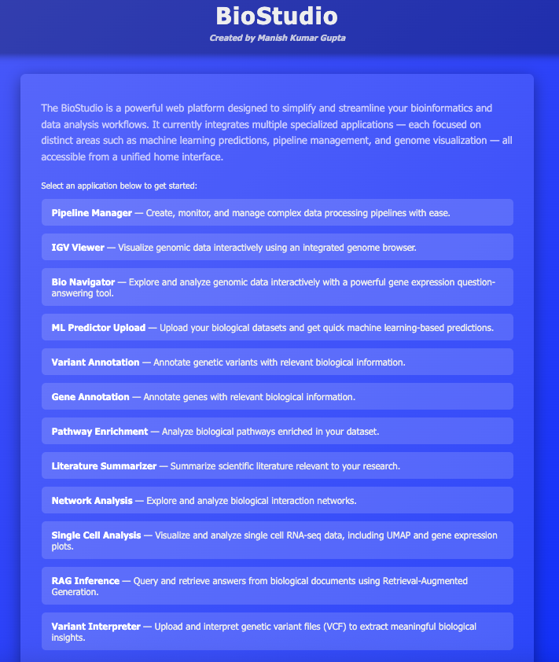

# BioStudio

A modular Django-based bioinformatics web application that integrates tools for genomic data visualization, machine learning prediction, variant annotation, and pathway enrichment analysis.

---

## Project Structure

```
BioStudio/
├── manage.py                # Django management script
├── db.sqlite3               # SQLite DB for development
├── start_app.sh             # Shell script to run the app
├── data/                    # Input/output data directory
├── home/                    # Landing page app
├── igv_viewer/              # Genomic viewer integration (IGV)
├── pipeline_manager/        # Workflow management tools
├── ml_predictor/            # Machine learning prediction tools
├── variant_annotation/      # Variant annotation functionality
├── pathway_enrichment/      # Pathway enrichment & GSEA
├── network_analysis/        # Keyword co-occurrence network visualization
├── literature_summarizer/   # Biomedical literature trend and entity analysis
├── single_cell_analysis/    # Single-cell RNA-seq data processing and visualization
├── gene_annotation/         # Functional annotation of genes and variants
├── ollama-server/           # Backend and API for Ollama LLM integration
├── bio_navigator/           # Interactive genomic data query and analysis using Hugging Face-powered AI
├── data_uploader/           # Data upload and processing for various apps
├── rag_inference/           # Retrieval-Augmented Generation (RAG) for querying biological documents
└── visualization_workbench/ # Main Django project config
```

---

## Getting Started

### 1. Clone the Repository

```bash
git clone https://github.com/your-username/visualization_workbench.git
cd visualization_workbench
```

### 2. Set Up Virtual Environment

```bash
python3 -m venv env
source env/bin/activate  # or `source env/bin/activate.fish` if using fish shell
```

### 3. Install Dependencies

```bash
pip install -r requirements.txt
```

> 💡 If you don’t have `requirements.txt`, install common dependencies manually:

```bash
pip install django gseapy pandas
```

### 4. Run Migrations

```bash
python manage.py migrate
```

### 5. Start the Server

```bash
./start_app.sh
# or
python manage.py runserver
```

Visit [http://127.0.0.1:8000](http://127.0.0.1:8000)

---

## Modules Overview

| Module                 | Description                                                                 |
|------------------------|-----------------------------------------------------------------------------|
| `home/`                | Landing page for the application                                            |
| `igv_viewer/`          | Visualize genomic tracks via IGV.js                                        |
| `pipeline_manager/`    | Launch and monitor pipelines or workflows                                  |
| `ml_predictor/`        | Apply ML models to biological datasets                                     |
| `variant_annotation/`  | Annotate VCF or variant files using bioinformatics tools                  |
| `pathway_enrichment/`  | Run Enrichr or GSEA on gene lists and visualize results                   |
| `network_analysis/`    | Analyze and visualize keyword co-occurrence networks from PubMed           |
| `literature_summarizer/` | Summarize, analyze trends, and extract entities from PubMed data using Large Language Models (LLMs) |
| `single_cell_analysis/` | Single-cell RNA-seq data processing and visualization                     |
| `gene_annotation/`     | Functional annotation of genes and variants leveraging LLMs               |
| `ollama-server/`       | Backend and API for Ollama LLM integration                                |
| `bio_navigator/`       | Interactive genomic data query and analysis using Hugging Face-powered AI |
| `data_uploader/`       | Upload and process biological datasets, including building FAISS indexes for RAG |
| `rag_inference/`       | Query and retrieve answers from biological documents using Retrieval-Augmented Generation (RAG) |

---

## Pathway Enrichment Input Formats

- **Enrichr**: `.tsv` file with **one gene per line**
- **GSEA**: `.tsv` file with **two columns**: `gene` and `score`

---

## Utilities

- `start_app.sh`: Custom shell script to launch the Django app
- `data/`: Temporary directory for uploaded and processed files


# Docker Usage

## Build Docker Image

To build the Docker image for the visualization_workbench Django application, run the following command from the root directory (where the Dockerfile is located):

```bash
docker build -t visualization_workbench:latest .
```

This command will:

Use the Dockerfile to create an image named visualization_workbench with the tag latest.

- Install all required system packages and Python dependencies.

- Set up the bioinformatics tools.

- Collect static files and apply Django migrations.

- Configure the app to run using gunicorn.

## Run Docker Container
To run the container and expose the application on port 8000, use:

```bash
docker run -d -p 8000:8000 visualization_workbench:latest

-d: Runs the container in detached mode (in the background).

-p 8000:8000: Maps port 8000 of your local machine to port 8000 inside the container (the Django default port).

```
### visualization_workbench:latest: Uses the Docker image you built.

After this, open your browser and navigate to:

```
http://localhost:8000
```

to access the Django web application.

## Kubernetes Deployment (Optional)

You can deploy BioStudio and Ollama Server using Kubernetes for production-ready scalability and orchestration. This setup uses Deployment and Service manifests located in the `K8s` directory.

---

### 1. Create a Namespace (optional)

```bash
kubectl create namespace biostudio
```
### 2. Apply Kubernetes Configurations
Apply the Deployment and Service manifests for both BioStudio and Ollama Server from the K8s folder:

```bash
kubectl apply -f K8s/biostudio-deployment.yaml
kubectl apply -f K8s/biostudio-service.yaml
kubectl apply -f K8s/ollama-deployment.yaml
kubectl apply -f K8s/ollama-service.yaml
```
### 3. Access the Applications
BioStudio: Accessible at http://localhost:30080 (assuming NodePort is configured as 30080).

Ollama Server: Accessible at http://localhost:31434 (assuming NodePort is configured as 31434).

If you are using Minikube, you can open the services using:

```bash
minikube service biostudio-service -n biostudio
minikube service ollama-service -n biostudio
```



